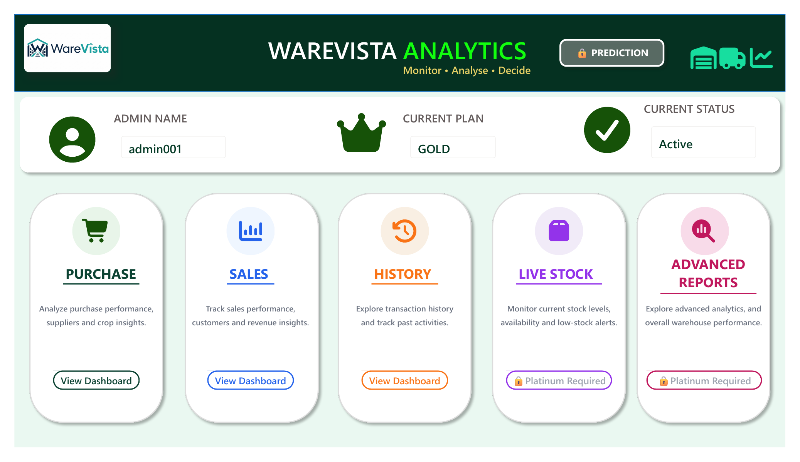
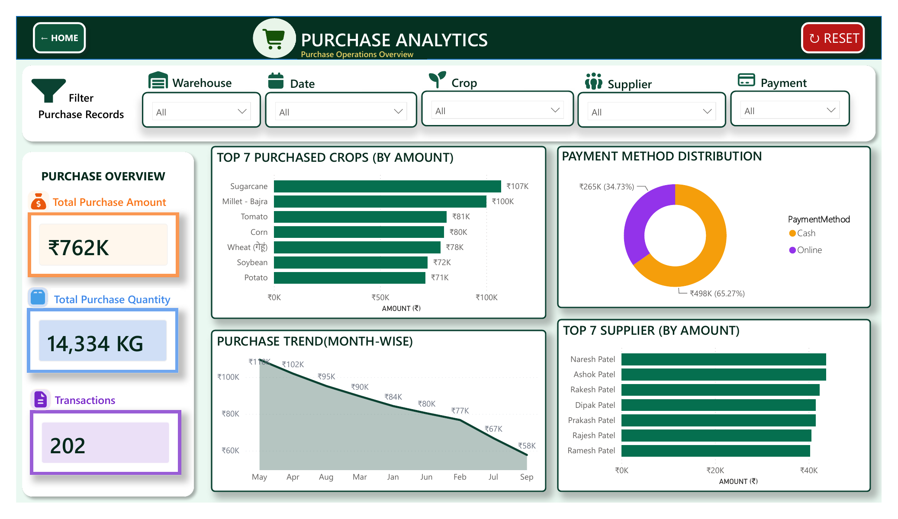
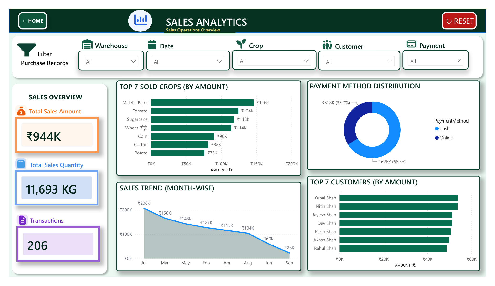
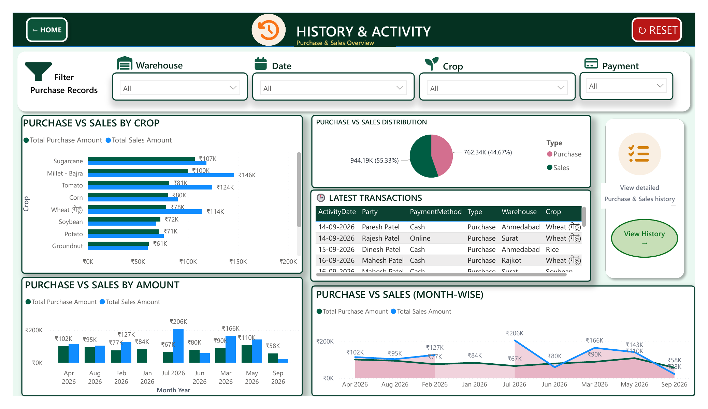
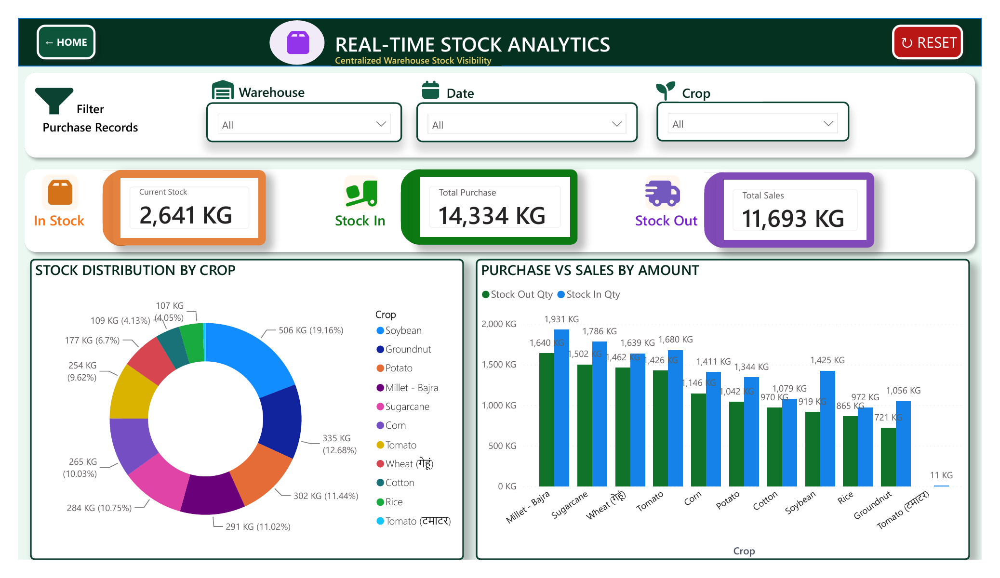
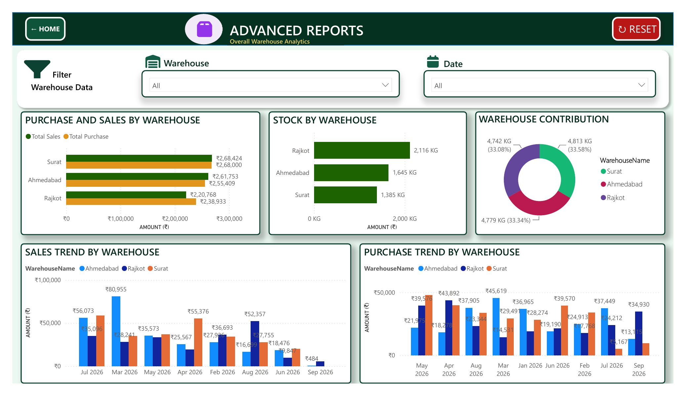
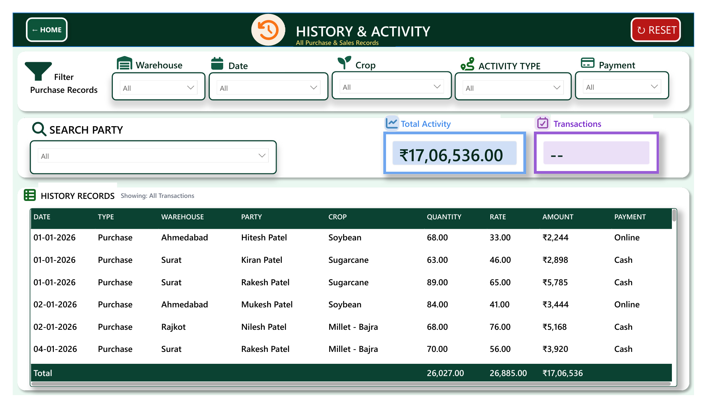
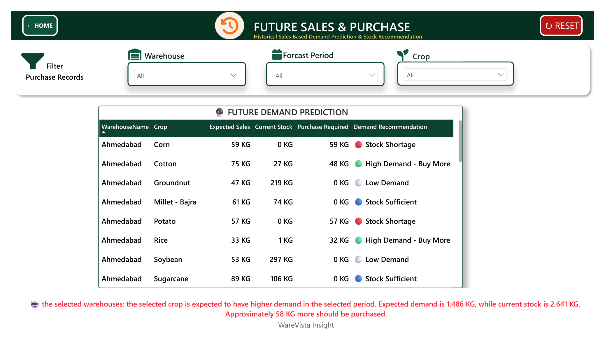
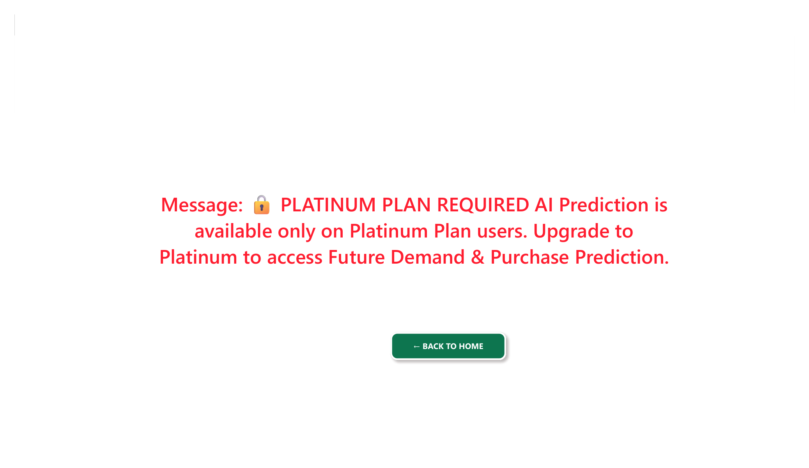

# WareVista Analytics Dashboard

A Power BI analytics dashboard for **WareVista** — the Smart
Agricultural Warehouse Monitoring and Analytics System. This
dashboard is the admin/owner-facing analytics layer: it reads the
same data the [WareVista app](https://github.com/khushi-project-space/WareVista_App)
writes (via its Google Apps Script + Google Sheets backend) and
turns it into an interactive, multi-page report.

## Related repository

- **App**: [khushi-project-space/WareVista_App](https://github.com/khushi-project-space/WareVista_App)
  — the Android application (Java/XML) that staff and admins use to
  record purchases, sales, and stock. See "Relationship to the main
  app" below for how the two connect.

## Contents

| File | Description |
|---|---|
| `WareVista_Analytics.pbix` | The full Power BI report — data model, DAX measures, and all report pages. |

## Report pages

The `.pbix` contains 9 pages:

1. **MAIN DASHBOARD** — landing page ("Monitor • Analyse • Decide"),
   shows the signed-in admin's name, current subscription plan, and
   account status, with navigation cards into each section below.
2. **PURCHASE ANALYTICS** — Total Purchase Amount, Total Purchase
   Quantity, and Transaction count; a month-wise purchase trend line
   chart; Top 7 Purchased Crops and Top 7 Suppliers (by amount); and
   a Cash vs. Online payment-method split. Filterable by Warehouse,
   Date, Crop, Supplier, and Payment method.
3. **SALES ANALYTICS** — the sales-side mirror of Purchase Analytics:
   Total Sales Amount/Quantity/Transactions, a monthly sales trend,
   Top 7 Sold Crops, Top 7 Customers, and payment-method split.
   Filterable by Warehouse, Date, Crop, Customer, and Payment method.
4. **HISTORY & ACTIVITY** — a combined Purchase-vs-Sales view: by
   crop, by month, by amount, plus a distribution pie chart and a
   "Latest Transactions" table, with a button through to the full
   Detailed History page.
5. **LIVE STOCK** — real-time stock visibility per warehouse: current
   stock level, Stock In / Stock Out, a stock-by-crop distribution
   donut, and a purchase-vs-sales-by-quantity (KG) chart. Filterable
   by Warehouse, Date, and Crop.
6. **ADVANCED REPORTS** — cross-warehouse view ("Overall Warehouse
   Analytics"): purchase and sales by warehouse, sales/purchase trend
   by warehouse, stock by warehouse, and a warehouse-contribution
   donut across the current warehouses (e.g. Ahmedabad, Rajkot,
   Surat).
7. **DETAILED HISTORY** — the full, searchable transaction log with
   filters for Warehouse, Date, Crop, Activity Type
   (Purchase/Sales), and Payment method.
8. **AI Prediction** — "Future Sales & Purchase Forecast": a
   historical-sales-based demand prediction and stock recommendation
   table, filterable by Warehouse, Crop, and Forecast Period.
9. **AI Prediction (Locked)** — the state shown to non-Platinum
   accounts: *"AI Prediction is available only on Platinum Plan
   users."* — this page enforces the same Free/Gold/Platinum gating
   the main app uses for its own features.

## Screenshots

| Main Dashboard | Purchase Analytics | Sales Analytics |
|---|---|---|
|  |  |  |

| History & Activity | Live Stock | Advanced Reports |
|---|---|---|
|  |  |  |

| Detailed History | AI Prediction | AI Prediction (Locked) |
|---|---|---|
|  |  |  |

> **Note on plan gating**: in the screenshots above (captured with a
> **GOLD**-plan admin account), **Live Stock** and **Advanced
> Reports** show as 🔒 **Platinum Required** on the main dashboard —
> so those two pages, not just AI Prediction, are Platinum-only. The
> exact plan → page-access mapping for FREE vs GOLD wasn't
> independently verified here; the screenshots above show what a
> GOLD account sees.

## Data model

The report is built on the following tables (matching the field
names used by the WareVista app's Purchase/Sales entry screens):

- **Purchase** — FarmerName, Crop, Warehouse, PaymentMethod,
  PurchaseDate, plus measures for Total Purchase Amount / Quantity /
  Rows and a purchase-month grouping.
- **Sales** — BuyerName, Crop, Warehouse, PaymentMethod, SalesDate,
  plus Total Sales Amount / Quantity / Transactions, and the
  AI-prediction measures (Expected Sales, Demand Recommendation,
  Purchase Required).
- **HistoryActivity** — a unified Purchase+Sales activity log (Type,
  Party, Crop, Warehouse, PaymentMethod, ActivityDate, Amount).
- **CropTable** — per-crop current stock, stock-in and stock-out
  quantities.
- **Warehouses**, **Users**, **Subscriptions** — warehouse names, the
  signed-in admin's name, and their current plan/status.
- **PaymentTable**, **TransactionType**, **DateTable**, **Forecast
  Period** — supporting lookup/dimension tables for the filters and
  the forecast page.

*(Table and field names above are read directly from the report's
visual field bindings; the underlying Power Query/data-source
connection itself — e.g. exactly which Google Sheet or range each
table loads from — is stored in a compressed part of the `.pbix` and
wasn't independently re-verified here. Open the report in Power BI
Desktop and check **Transform Data → Data source settings** to
confirm/update the connection before refreshing.)*

## Requirements

- **Power BI Desktop** (recent version — this file was last saved
  from the 2026.06 release train) to open and edit the report.
- Access to the underlying Google Sheets data source to refresh the
  data (you'll be prompted to sign in / re-enter credentials the
  first time you open this on a new machine — Power BI does not
  store Google account credentials inside the `.pbix` file).
- A Power BI Pro/PPU license (or the Power BI service) if you want to
  publish this report online for the owner to view from a browser
  instead of Power BI Desktop.

## Getting started

1. Clone this repository:
   ```bash
   git clone https://github.com/khushi-project-space/WareVista_Analysis_Dashboard.git
   ```
2. Open `WareVista_Analytics.pbix` in Power BI Desktop.
3. If prompted, sign in to the Google account that has access to the
   WareVista Google Sheets backend, then **Refresh** to pull the
   latest purchase/sales/stock data.
4. Navigate the report using the cards on **MAIN DASHBOARD**, or the
   page tabs at the bottom of the Power BI window.

## Relationship to the main app

This dashboard is a companion to the
[WareVista app](https://github.com/khushi-project-space/WareVista_App)
— it does not modify or write back to the app's data; it's a
read-only analytics view for the admin/owner. Feature parity note:
the **Platinum-only AI Prediction** gating here matches the
Free/Gold/Platinum subscription logic already enforced in the app's
`SubscriptionManager`.

## Dashboard screenshots — file layout

The `.pbix` file itself doesn't render on GitHub, so the 9 PNGs
referenced in the **Screenshots** section above are what let people
preview the dashboard without opening Power BI. They live at the
**repository root** (same level as `README.md` and the `.pbix` file),
not in a subfolder:

```
WareVista_Analysis_Dashboard/
├── WareVista_Analytics.pbix
├── README.md
├── main-dashboard.png
├── purchase-analytics.png
├── sales-analytics.png
├── history-activity.png
├── live-stock.png
├── advanced-reports.png
├── detailed-history.png
├── ai-prediction.png
└── ai-prediction-locked.png
```

If you'd rather tidy these into a `screenshots/` subfolder later,
move the 9 files there and add a `screenshots/` prefix back onto each
`` path in the Screenshots section above — otherwise leave
them at root and the paths above already match.

### Updating screenshots later (new data, new pages, etc.)

1. In Power BI Desktop, open `WareVista_Analytics.pbix` and use
   **File → Export report → Export to PDF** to export all pages at
   once as a single PDF (one page each, in the same left-to-right
   page-tab order as "Report pages" above).
2. Convert each PDF page to a PNG — e.g. with
   [poppler's `pdftoppm`](https://poppler.freedesktop.org/) (what was
   used to generate the current screenshots, since it rasterizes the
   full page cleanly, vector charts included) or
   [ImageMagick](https://imagemagick.org/):
   ```bash
   pdftoppm -png -r 150 WareVista_Analytics.pdf page
   # or: magick -density 150 WareVista_Analytics.pdf page-%d.png
   ```
3. Rename each `page-N.png` to match the table in the **Screenshots**
   section (page 1 → `main-dashboard.png`, page 2 →
   `purchase-analytics.png`, etc.), overwriting the old files at the
   repo root.
4. Commit and push:
   ```bash
   git add *.png
   git commit -m "Update dashboard screenshots"
   git push
   ```

If you add/remove/reorder report pages, update the ``
entries in the Screenshots section to match.

Tip: keep each PNG under ~1–2 MB (resize/compress if needed) so the
README loads quickly on GitHub — the current set is already well
under that at 50–320 KB each.

## License

No license file is currently included in this repository. Add one
(e.g. MIT, Apache-2.0) if you intend for others to reuse this report.
